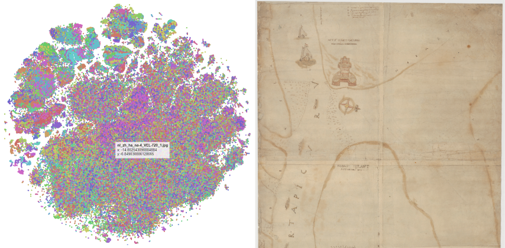

# Visualize large OpenTSNE dataset

Some code to quickly visualize a large number of points from an OpenTSNE dataset. Mostly based on [this blogpost](https://blog.scottlogic.com/2020/05/01/rendering-one-million-points-with-d3.html) by @ColinEberhardt.

## Usage
Add your data in the `data` directory in a file named `openTSNE_data.csv` with the following columns: 

| Group | Id  | Path | TSNE_1 | TSNE_2 |
|-------|-----|------|--------|--------|
| ...   | ... | ...  | ...    | ...    |

I prefer to use [uv](https://github.com/astral-sh/uv), but you can install and run this project using any Python tools of your liking.
```bash
uv venv
uv run -- main.py
```
